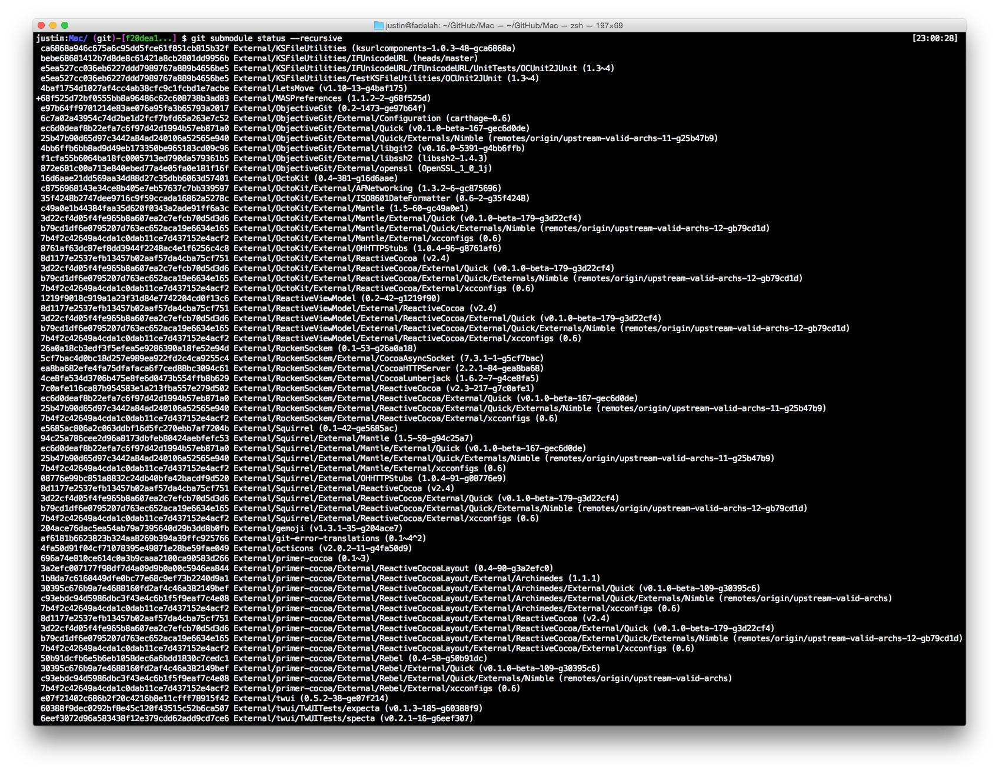
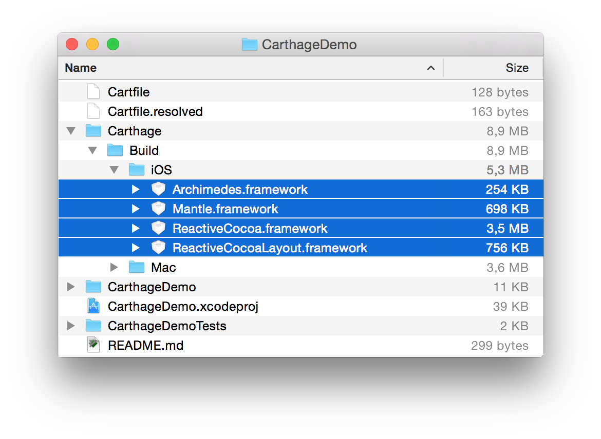
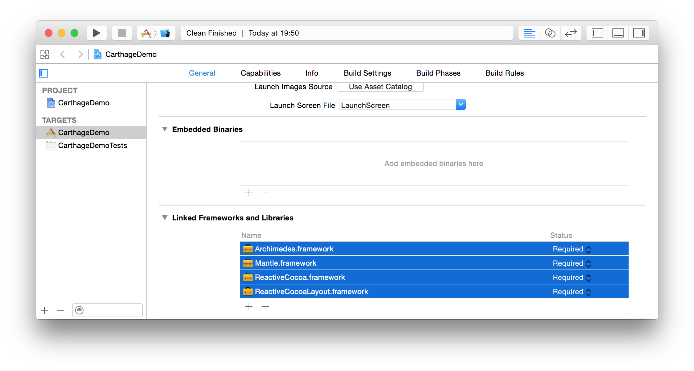
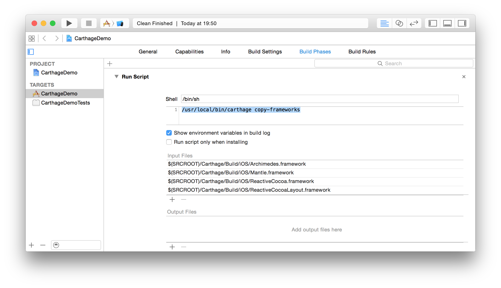
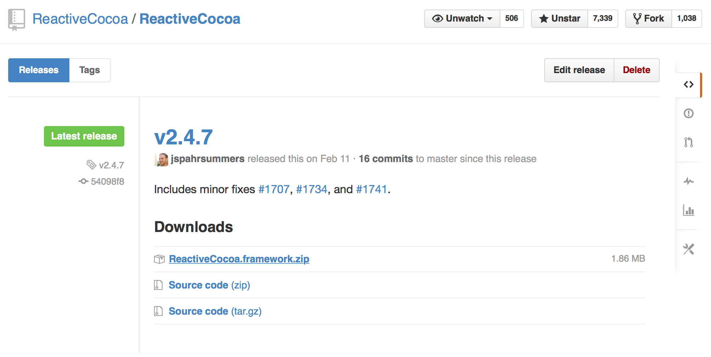

# [fit] Ruthlessly Simple
# [fit] Dependency Management
## with
# [fit] Carthage


^ (logo by Reda Lemeden)

^ Carthage is a dependency manager, intended to be simplest way to add
frameworks to your Cocoa project. In this talk, I’ll explain exactly what
Carthage is, how to use it, _why_ it exists, and then go into some of the inner
workings as well.

^ If you’ve been interested in Carthage, but not sure how to get started, or
want to know why we didn’t just use and contribute to CocoaPods, I hope you’ll
walk away from this talk with those answers.

---

# [fit] Justin Spahr-Summers
# @jspahrsummers

   

^ I’m a desktop developer at GitHub, primarily working on GitHub for Mac.
Besides Carthage, I’ve also played a major role in Mantle and ReactiveCocoa, and
several other open source libraries.

---

# [fit] The Problem

---

> GitHub for Mac has what could be called “excessively nested submodules.”
--Me, late 2014



^ For the longest time, GitHub for Mac imported dependencies exclusively through
Git submodules and Xcode subprojects. This works pretty well until your
dependencies have a shared dependency on something else.

---


^ In our case, we used ReactiveCocoa and Mantle within several of our other
libraries. Because the app must ultimately pick one version of RAC to link,
problems can arise if libraries expect different versions of RAC.

^ Most dangerously, there’s often no indication that this is the case, unless
you’re (comparatively) lucky and get a build failure.

---

# [fit] Why not use
# [fit] CocoaPods?

^ Although submodules are problematic in some ways, we also weren’t interested
in using CocoaPods.

---

# Podspecs

^ As library authors, we were frustrated with CocoaPods’ requirement that we add
podspecs for all of our projects. After all, this information already exists in
Xcode and Git, so why should we duplicate it to another place?

---

# Less control

^ As users, we were frustrated with CocoaPods’ control of the project setup
process. We know how to set up Xcode projects, and the automated nature of it
often took away our flexibility.

^ Yet, if we were to disable that feature, we would be stuck manually adding and
removing files as our dependencies get updated.

---

# Centralized

^ CocoaPods Trunk is a central package management service, backed by a GitHub
repository, that is responsible for serving up podspecs.

^ We think a centralized list makes library authors’ jobs harder, because
they’re now responsible for deploying releases to yet another place. It also
makes it harder to use library versions that haven’t been recorded there, or to
use libraries that don’t have any CocoaPods support at all!

---

# Ruby

^ Even if we could’ve fixed the aforementioned issues, CocoaPods is written in
Ruby. And while we could certainly learn enough Ruby to do something useful,
it’s definitely an obstacle to contributing. We aren’t Ruby developers by trade,
and our time is limited, so it was hard to justify.

---

# :cry:

^ It became clear that the existing solution wouldn’t really work for us, and
that we weren’t in a position to change it to suit our needs.

---

# @robrix
# @mdiep
# @keithduncan
# @alanjrogers

^ So, during one of GitHub’s “Open Source Fridays,” these folks and I started discussing what a new
dependency manager for Cocoa might look like.

---

# Our goals
# [fit]  ⇄  ⇆ 

1. Pick compatible versions for all dependencies
1. Check out dependencies with Git
1. Build frameworks with Xcode

^ Mostly, we wanted a simple coordinator between Xcode and Git, plus
a constraint solver for resolving dependency versions.

^ You can see from this list that Carthage integrates heavily with your standard
tools. All that Carthage does on its own is find the right version, then tell Xcode
and Git what to do.

---

# How do you use it?

^ So, how do you actually set up an application project with Carthage?

---

# Step 1: Create a Cartfile

```
github "Mantle/Mantle" ~> 1.5
github "ReactiveCocoa/ReactiveCocoa" ~> 2.4.7
github "ReactiveCocoa/ReactiveCocoaLayout" == 0.5.2
```

^ Let’s set up a project that will use Mantle, ReactiveCocoa, and the less
well-known ReactiveCocoaLayout. (Explain each line of the Cartfile.)

---

# Step 2: Run Carthage

```
$ carthage update
*** Fetching Mantle
*** Fetching ReactiveCocoa
*** Fetching ReactiveCocoaLayout
*** Fetching Archimedes
*** Downloading Archimedes at "1.1.4"
*** Downloading Mantle at "1.5.4"
*** Downloading ReactiveCocoa at "v2.4.7"
*** Downloading ReactiveCocoaLayout at "0.5.2"
*** xcodebuild output can be found in /var/folders/t6/tjsdgjqd6j7_vjgb66qvwlb80000gn/T/carthage-xcodebuild.lisVLC.log
```

^ Then, we’ll run `carthage update` to download and install all the
dependencies.

^ Notice that it pulled in Archimedes, which is a dependency of
ReactiveCocoaLayout, and that it picked the newest compatible version of Mantle
available.

---

# Step 3: Linked Frameworks and Libraries

 

^ Now that we have built frameworks on disk, we simply need to drag them into
the “Linked Frameworks and Libraries” section of the app target.

---

# Step 4: Strip architectures (iOS only)



^ Unfortunately, we're not quite done yet. Because of an App Store submission
bug that disallows universal (fat) framework binaries, we need to add
a special build phase that removes them. I’m hoping that Apple eventually makes
this step unnecessary.

---

# That’s it!

^ We now have an app that can begin using any and all of those frameworks, and
it’s quite easy to update the list in the future by just running `carthage
update` again.

---

# “Ruthlessly simple”

^ These steps, and even the little bit of manual work at the end, hint at the
philosophy behind Carthage.

^ The prevailing design goal, overriding almost all others, is “ruthless
simplicity.” We want a tool that is as simple as possible, and will try very
hard to avoid features that add significant complexity.

---

# Simple vs. Easy

Easy: _familiar_ or _approachable_
Simple: fewer concepts and concerns

See Rich Hickey’s talk, [Simple Made Easy](http://www.infoq.com/presentations/Simple-Made-Easy)

^ Simple and easy are not the same thing.

---

# Simple vs. Easy

CocoaPods is _easy_
Carthage is _simple_

^ CocoaPods is all about making it as easy as possible to find and use
libraries, but it achieves those goals at the cost of complexity. It becomes
easier but less simple.

^ With Carthage, we really wanted to focus on simplicity, because we believe
that the benefits are enormous. For example…

---

# Simpler tools are…

Easier to maintain

^ By keeping things simple, and our problem space small, we don’t need to handle
as many edge cases. And by integrating with other tools, like Xcode and Git, we
delegate responsibility and maintenance to them, so there’s less for Carthage to
do.

---

# Simpler tools are…

Easier to understand

^ Simplicity makes it easier to understand how Carthage works and how to use it,
because it helps users create a mental model of what’s going on. If something
goes wrong (e.g., because of a bug), understanding the tool may help the user
resolve the issue on their own.

---

# Simpler tools are…

Easier to contribute to

^ This is related to the previous points, but important in its own right. It’s
a lot easier to implement fixes or new features within a simple codebase than
a complex one.

---

# Simpler tools are…

More flexible and composable

^ It’s impossible for developers to predict all the possible ways that someone
might want to use their software. So if there’s a use case out there that we’re
not anticipating, it’s a lot easier for the user to bend a simpler tool to their
will than to convince a complex tool to do exactly what they want.

---

# Simpler tools are…

Automatically made better as their integration points get better

^ In other words, for the parts where we hand off responsibility to Xcode and
Git, we automatically benefit from improvements made to those tools, with little
or no effort on our part.

^ On the other hand, the more we try to duplicate their functionality (even in
small amounts), the more fragile our system becomes, and the more we stand to
lose when those tools change.

---

# How does it work behind the scenes?

`carthage update` proceeds through the following steps:

1. Parse the Cartfile
1. Resolve the dependency graph
1. Download and check out all dependencies
1. Build all dependencies

^ Now, onto the mechanics of how it works!

^ Let’s dive into each step.

---

# Parsing the Cartfile

1. Parse [OGDL](http://www.ogdl.org)
1. Break down into a list of dependencies
1. Determine the type of dependency (`github` or `git`)
1. Parse any version constraint

^ Carthage files are written in a subset of OGDL, the Ordered Graph Data
Language. Originally, the logic for parsing our subset was written using
NSScanner, but we’re now moving to a more complete parser called ogdl-swift.

^ (Explain remaining steps.)

---

# Resolving the dependency graph

1. Propose a graph using the latest allowed version for all dependencies
1. Incorporate any Cartfiles for those dependencies (at those versions!) into the graph
1. If the graph is no longer valid, throw it out and try with the next possible version
1. Rinse and repeat until a valid graph is found

^ This is highly inefficient in terms of algorithmic complexity, but performs
surprisingly well in practice. Part of it is because our resolution algorithm
throws out graphs the moment they become invalid, and part of it is because our
resolution algorithm automatically terminates upon finding the first valid
solution.

---

# Downloading a dependency

1. Fetch the repository into a global Carthage cache
1. Run a modified `git checkout` to copy the right version of the repository into Carthage/Checkouts

^ There’s some more complexity here in practice (for example, dealing with
submodules), but this is the way to think about the workflow.

---

# Building a dependency

1. Symlink the Carthage/Build folder from the application project into the
dependency’s folder
1. Run `xcodebuild -list` on the rootmost `xcodeproj` to find shared schemes
1. Filter out any schemes which do not build a dynamic framework
1. Find the rootmost `xcodeproj` _or_ `xcworkspace`, which will be used for
building
1. For each scheme, build for each of the platforms it supports
1. If we built multiple architectures, use `lipo` to combine them into
a universal framework
1. Copy the final build products into the shared Carthage/Build folder

^ And we’re done!

---

# Bonus: prebuilt binaries!



```
*** Downloading ReactiveCocoa at "v2.4.7"
```

^ You may have noticed earlier that Carthage didn’t actually _build_ the
dependencies listed in the Cartfile. That’s because each one of these projects
has Releases on GitHub with binaries attached.

^ Whenever possible, Carthage will download binaries instead of building from
scratch, saving you time. On GitHub for Mac, this cut build times by almost 70%,
from 9.5 minutes to about 3!

---

# CarthageKit

^ Most of Carthage’s core behavior is actually implemented as a framework of its
own, CarthageKit.

^ This helps us provide modularity and makes testing easier, but it’s also
intended to make Carthage integration easier. If you want to build a tool on top
of Carthage, or compatible with Carthage, CarthageKit is your friend.

---

# Why is it written in Swift (and not Objective-C)?

* Type safety
* Value types (especially enums)
* Much faster to write
* Better modularization
* Desire to write a complete app using The Next Big Thing

^ (Explain each.)

---

# Why does it use ReactiveCocoa?

* Simplifies the invocation of shell tasks (see ReactiveTask)
* Simplifies networking (e.g., the GitHub API)
* Simplifies the dependency resolution algorithm
* Needed a real world application of RAC’s Swift API

^ (Explain each.)

---

# 1.0

1. Per-project settings
1. CarthageKit API review
1. CLI parameter review
1. Profit!!! 💸

^ I'd like to finish by talking about why Carthage isn't at 1.0 yet, and what it
will take to get there. (Talk about each item.)

^ 1.0 is really important to me, because it makes Carthage "real." We have an
0.7 release to do, and then 1.0 is up right after that, so it shouldn’t be too
long now. Keep an eye out!

---

# Questions?

Thanks to: TODO
